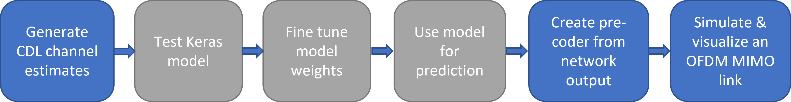
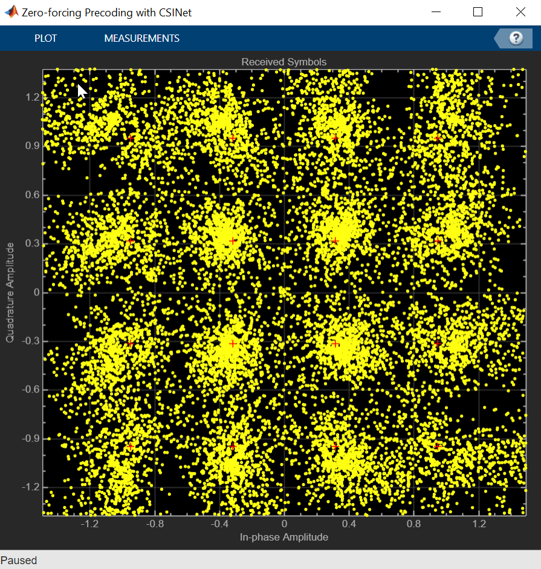

# Simulate Channel Compression Effect on Precoding Using MATLAB and Keras with CSINet

This example shows how to co-execute MATLAB&reg; and Python&reg; to simulate the effect of channel estimate compression on precoding in a MIMO OFDM channel. It shows how to:
* Generate CDL channel estimates in MATLAB using the [5G Toolbox&trade;](https://www.mathworks.com/products/5g.html)
* Load and test a pre-trained CSINet Keras&trade; model using co-execution with Python
* Fine tune the model weights through transfer learning using co-execution with Python
* Simulate the effect of channel estimate compression on precoding in MATLAB using the [5G Toolbox](https://www.mathworks.com/products/5g.html) and [Communications Toolbox&trade;](https://www.mathworks.com/products/communications.html)

The following figure summarizes the operations executed in MATLAB (marked in blue) versus those executed in Keras (marked in grey).

## Overview

There are different options for accessing deep learning models within MATLAB, including:

1. Using models created in MATLAB using [Deep Learning Toolbox&trade;](https://www.mathworks.com/products/deep-learning.html)
2. [Converting](https://www.mathworks.com/help/deeplearning/deep-learning-import-and-export.html) models from other frameworks into MATLAB
3. Co-executing models from other frameworks with MATLAB

This example provides an overview of the third approach. Co-execution is useful for leveraging [wireless products in MATLAB](https://www.mathworks.com/solutions/wireless-communications.html) from MATLAB 
to test existing deep learning models from other frameworks in an end-to-end link simulation. 
This workflow also allows engineering teams working with MATLAB & Python deep learning frameworks to easily combine their work in one environment.
Approaches one & two are useful for building deep learning models from scratch or for using additional capabilities from the [Deep Learning Toolbox](https://www.mathworks.com/products/deep-learning.html) with pre-trained models, such as [Deep Learning Code Generation](https://www.mathworks.com/help/deeplearning/deep-learning-code-generation.html) or [deep learning models in Simulink&reg;](https://www.mathworks.com/help/deeplearning/ug/classify-images-in-simulink-with-imported-tensorflow-network.html). 

### Requirements
To run this example, you need:
- [MATLAB](http://www.mathworks.com) R2022b or later
- [Communications Toolbox](https://www.mathworks.com/products/communications.html)
- [5G Toolbox](https://www.mathworks.com/products/5g.html)
- [Python](https://www.python.org/downloads/release/python-3104/) (tested with version 3.10.4)
- [TensorFlow&trade;](https://www.tensorflow.org/) (tested with version 2.10.0)
- [Keras](https://keras.io/) (tested with version 2.10.0)
- [Numpy&trade;](https://numpy.org/) (tested with version 1.23.4)

For more information about installing Python, see [Install Supported Python Implementation](https://www.mathworks.com/help/matlab/matlab_external/install-supported-python-implementation.html).

## Running the Example
Open and run the live script `SimChanCompEffOnPrecodingUsingMATLABAndKerasWithCSINetExample.mlx`. 
To generate a new CDL channel estimates dataset, use the live script `GenerateCSINetDataSet.mlx`. 
The live scripts use the helper files `preprocessChannelEstimate.m` and `postprocessChannelEstimate.m` for pre/post-processing the training and testing data sets.

### Visualize the channel compression effect
By the end of the example, you will be able to visualize the effect of channel feedback compression with CSINet [1] on the received constellation of an OFDM MIMO channel with zero-forcing precoding.
The following figure shows the effect of using CSINet for channel feedback with compression rate 1/4 and normalized mean square error -42 dB in a CDL channel with the following parameters:
* Tx Antennas: 32
* Rx Antennas: 2
* Delay Profile: CDL-B
* RMS delay spread: 100 ns
* Max delay after truncation: 32
* Max Doppler: 2 Hz
* Resource blocks: 48 
* Subcarrier spacing: 30 KHz

## References
[1] Wen, Chao-Kai, Wan-Ting Shih, and Shi Jin, "Deep learning for massive MIMO CSI feedback," IEEE Wireless Communications Letters, vol. 7, no. 5, pp. 748-751, Oct. 2018.

Copyright 2023, The MathWorks, Inc.